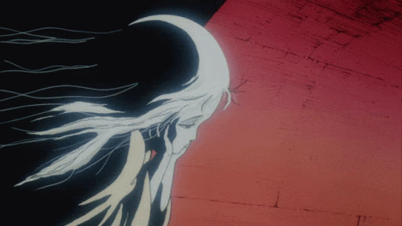

<!-- ANGEL'S EGG README -->

  

  
  
  
  
  
  

  

 

<table align="center">
<tr>

<td width="60%">

sobre mim

  

Estudante de Análise e Desenvolvimento de Sistemas na Unicesumar — Londrina, PR.
Tenho interesse na construção de interfaces e em entender como tudo se conecta por trás dos bastidores.
Falo inglês fluentemente, o que me permite aprender de formas mais amplas.
Estou sempre tentando transformar o que aprendo em algo funcional e real.

  

Seja bem-vindo ao meu GitHub.

</td>

<td width="40%" align="center">
  
</td>

</tr>
</table>

 

  

  

  

<i>夢を見ているのか、それとも現実なのか。</i>

 

<i>isso é tudo por enquanto.</i>

  

<h3>repositórios em destaque</h3>

  